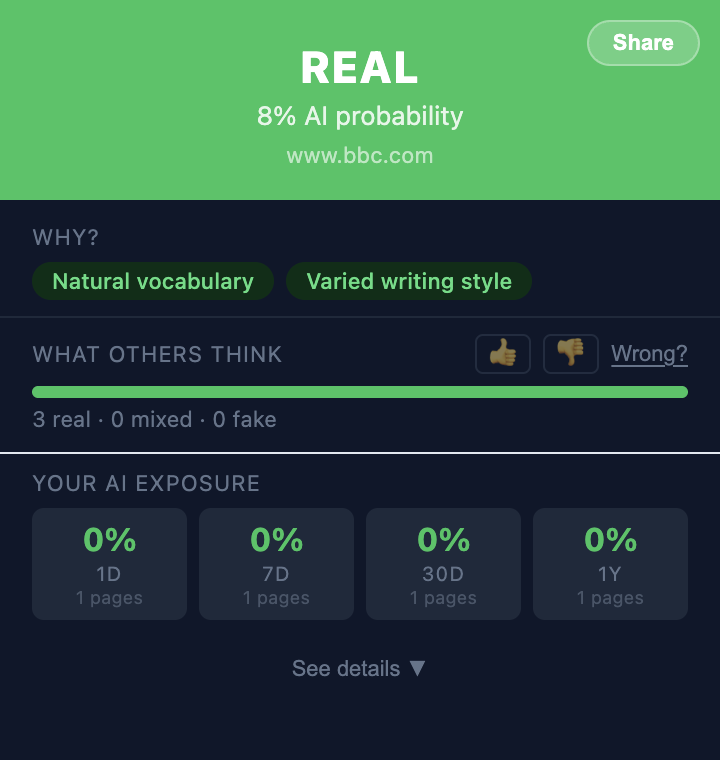
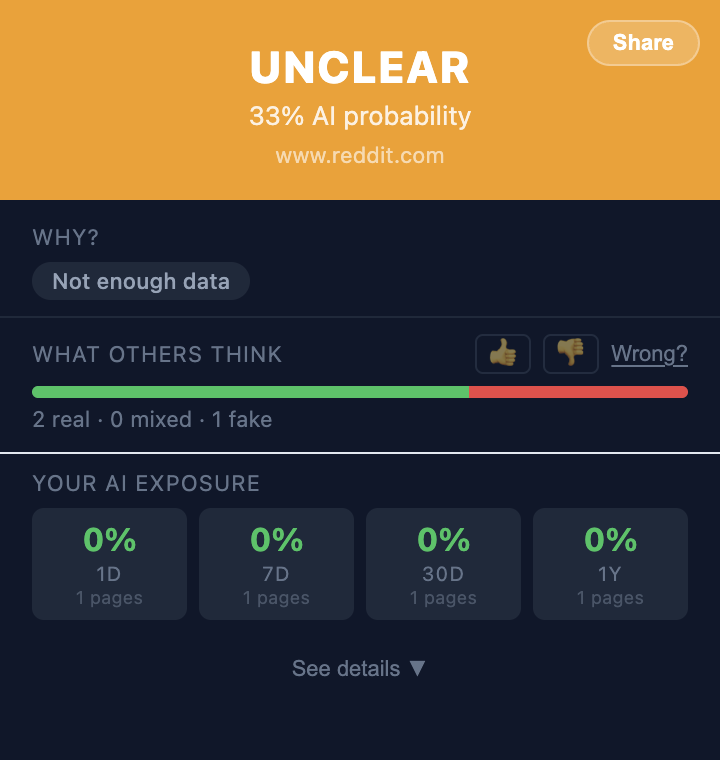
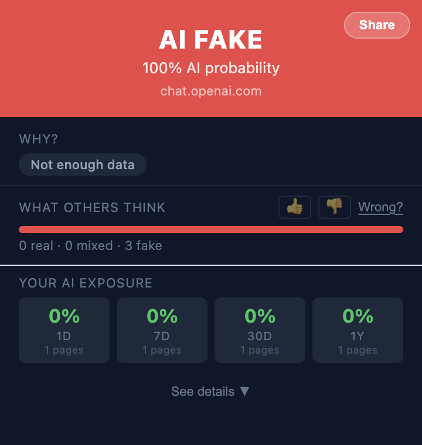

<div align="center">


<h1>🥸 AI Fake Or Real</h1>

<p><strong>See what's real in your social media feed.</strong><br/>Like an ad blocker, but for AI-generated content.</p>

<p>
  
  
  
</p>

<sub>One tap on the toolbar gives the verdict for any page — 🟢 Real · 🟡 Unclear · 🔴 AI Fake</sub>

</div>

AI Fake Or Real is a free browser extension that runs in the background while you scroll Reddit, Instagram, YouTube, Facebook, TikTok, and X — flagging AI-generated posts, images, and text so you always know what's real.

## How it works

You browse normally. The extension does the rest.

- 🟢 **✓** — Real. Made by a human.
- 🟡 **?** — Unclear. Could go either way.
- 🔴 **AI** — AI Fake. Probably AI-generated.

On social media, badges appear directly on posts in your feed. No clicking, no interruption.

## Features

- **📱 In-feed badges** — AI posts flagged right in your Reddit/Instagram/Facebook/YouTube/TikTok/X feed
- **🙈 Avoid AI** — optionally blur or hide high-confidence AI posts (not just badge them), with one-click reveal
- **👥 Community votes** — see what other users think, vote 👍 Real or 👎 AI Fake
- **📊 AI exposure stats** — what % of your browsing is AI content (1D/7D/30D/1Y)
- **⚡ Instant & local-first** — in-feed badges, hide/blur, and AI-exposure stats run locally in your browser; only deep analysis of a page you check is sent to the server
- **🤖 LLM-powered** — 8 AI models for deep analysis (text, images, video), with automatic failover
- **🔑 Bring your own keys** — optionally add your own API key for any of the 8 providers in Settings, and pick which to try first
- **💰 Free forever** — no subscription, no word limits, open source

## Install

- **[Chrome / Edge / Brave](https://chrome.google.com/webstore/detail/ai-fake-or-real)** — one click install
- **[Firefox](https://addons.mozilla.org/addon/ai-fake-or-real/)** — coming soon
- **Manual:** `chrome://extensions` → Developer mode → Load unpacked → `extension/dist/`

## Not a plagiarism checker

GPTZero and Originality.ai are for teachers checking essays. **AI Fake Or Real is for your feed.** It runs passively while you scroll, it's free, and it has community voting — features nobody else has.

## Quick start (development)

```bash
# Extension
cd extension && npm install && npm run build

# Server
cd server && npm install && npm run build && npm start
```

Set any LLM API keys to activate AI detection (all optional, system auto-failovers):
```bash
export GEMINI_API_KEY=...    # Best free tier
export GROQ_API_KEY=...      # Fastest
export OPENAI_API_KEY=...    # Vision support
# + Anthropic, Mistral, Cohere, Together, Cloudflare
```

## Docs

- **[Product overview](docs/product.md)** — what it does and who it's for
- **[Deployment guide](docs/deployment.md)** — server, extension, multi-browser
- **[Deploy on Fly.io + Neon](docs/deploy-fly.md)** — near-free hosting runbook
- **[API reference](docs/API.md)** — for developers building on top
- **[Cost & scaling](docs/scaling.md)** — how it stays cheap and pays for itself
- **[Privacy policy](docs/privacy-policy.md)**

## Project structure

```
extension/          Browser extension (Chrome MV3 + Firefox)
  src/
    background/     Service worker (badge, caching, history)
    content/        Content script (page readers, scanner, overlays)
    popup/          React popup UI
    common/         API client, types, history tracking
server/             Node.js/Fastify backend
  src/
    routes/         API endpoints
    services/       LLM detection (8 providers), scoring
    shared/         Heuristic scanner
tests/              Integration tests + screenshot generators
docs/               Product docs, store listing, landing page
```

## License

MIT
